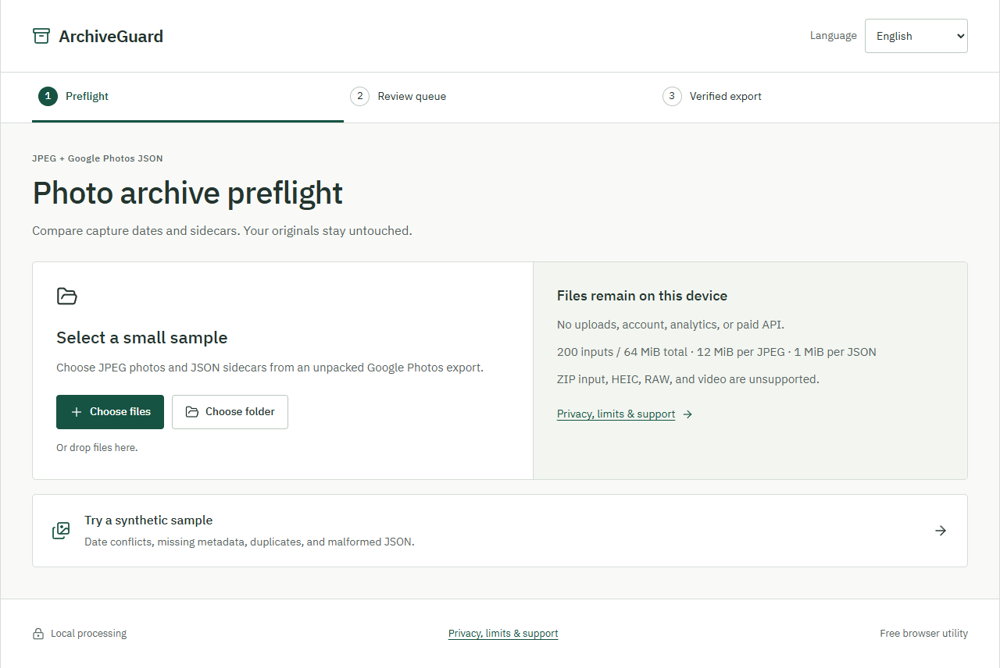
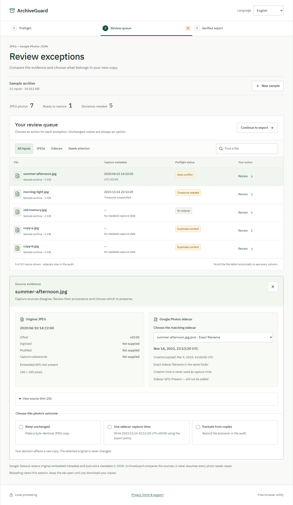
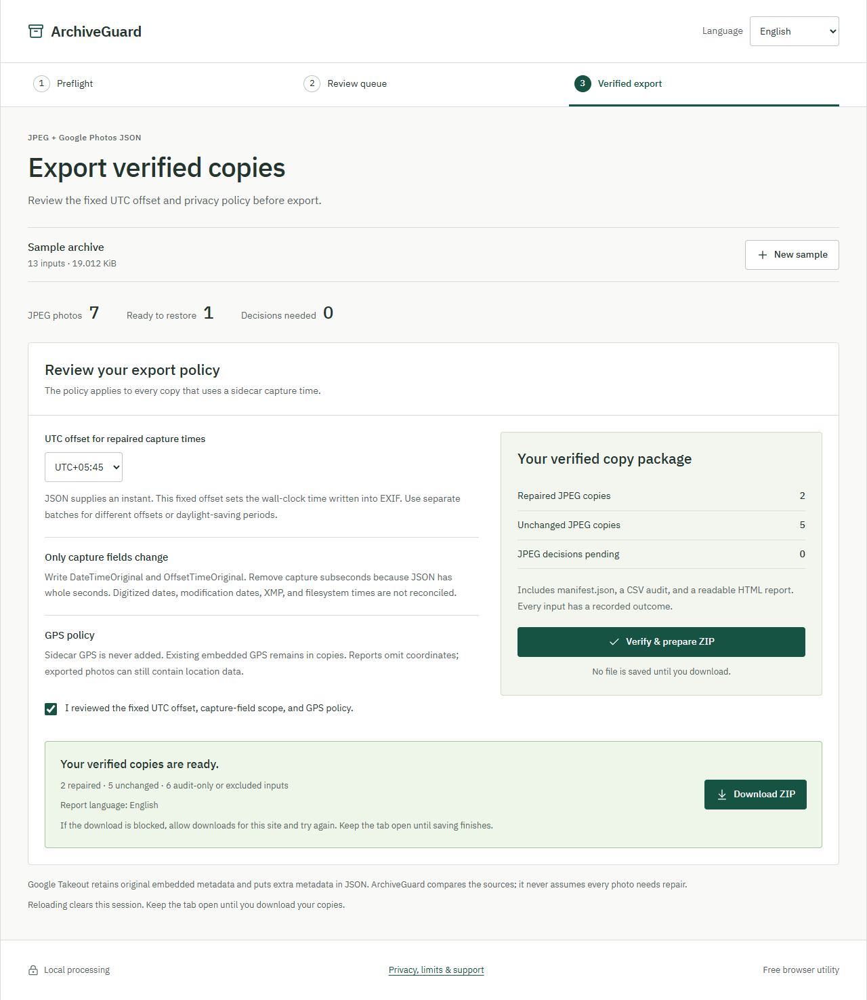
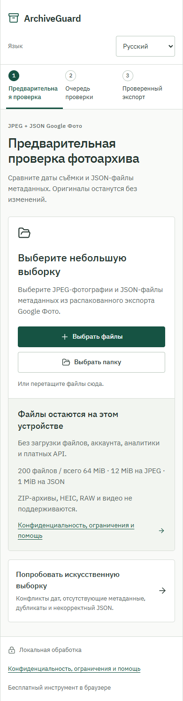

# ArchiveGuard

Review a selected photo archive before moving it. Compare JPEG capture metadata with Google Photos JSON sidecars, decide how to handle exceptions, and download verified **new copies** with an audit trail. Free, browser-only, no account or paid API.

**[Open ArchiveGuard](https://seoshiro.github.io/archiveguard/)** · [Privacy and limits](https://seoshiro.github.io/archiveguard/privacy.html) · [Validation](docs/VALIDATION.md)



## Use it

1. Try the synthetic demo, or choose JPEGs and their JSON sidecars from an unpacked Google Photos export. Folder selection retains relative paths. ZIP input is unsupported.
2. Inspect every selected input. Exact, same-folder matches are proposed only when unambiguous. Open the review queue for date conflicts, missing offsets, uncertain matches, duplicate content, and missing sidecars.
3. Compare the date sources. Keep an unchanged copy, choose an eligible capture sidecar, or exclude the photo. Upload/creation dates are never used as a capture fallback.
4. Review one fixed UTC offset for the batch and acknowledge the capture-field and GPS policy. Use separate batches for different capture offsets or daylight-saving periods.
5. Prepare and download the ZIP. It includes JPEG copies, `manifest.json`, `audit.csv`, and `audit.html`, with an outcome for every input.



Original files are never opened for writing, overwritten, deleted, or deduplicated. Cancel stops the active worker or demo download. No output is offered until the entire export passes verification. Changing any decision or policy revokes the previous download.

The complete interface and privacy help are available in **English, Русский, Қазақша**. Change language at any point without losing imported files or decisions. Only the language preference is saved locally; blocked browser storage remains usable. Human-readable HTML/README reports use the language selected when preparing the ZIP. JSON/CSV keys and canonical values remain stable. Switching language preserves a prepared package and displays its report language; prepare again to change it.

Browser Back/Forward moves between workflow steps without replacing the active sample. Privacy help opens separately. Reloading clears archive data and decisions.

## What verification means

Repair writes `DateTimeOriginal` and `OffsetTimeOriginal` into a copy and removes `SubSecTimeOriginal`, because sidecar capture instants have whole-second precision. It leaves supported unrelated EXIF values unchanged, including digitized and modification dates. XMP dates and filesystem timestamps are not reconciled.

The app compares supported EXIF values before and after writing, then reads capture fields back using both piexifjs and exifr. It hashes every JPEG byte outside EXIF, including compressed image scans, ICC, IPTC, and XMP. The repair path never decodes or re-encodes pixels. Source and output SHA-256 values are recorded separately: a repaired file's whole-file checksum normally changes.

Frame and initial scan validation is not a complete JPEG decoder or corruption detector. Preservation checks prove the compared bytes were preserved; they do not prove an arbitrary image is fully decodable. Tests independently decode synthetic outputs and compare pixel hashes.



## Privacy

Photos, sidecar contents, filenames, dates, and GPS stay in your browser's memory. There are no uploads, analytics, remote fonts, external AI calls, or archive storage. Closing or reloading the tab clears the session. A single language code is the only persisted app preference. Synthetic demo assets and licensed fonts are served from the app's own origin. GitHub Pages may log ordinary visitor requests/IP addresses for hosting security; those requests contain no selected archive data.

Sidecar GPS is never added. Existing embedded GPS remains in copied JPEGs, with an explicit export acknowledgement. Reports omit coordinates but contain filenames, dates, hashes, and decisions. Keep both downloaded photos and audit reports private when appropriate.

## Supported scope

This is a JPEG sample preflight, not universal archive repair or a validated commercial offering.

| Boundary | Supported behavior |
|---|---|
| Batch | Up to 200 inputs / 64 MiB total |
| Individual files | JPEG up to 12 MiB; JSON up to 1 MiB |
| JPEG structure | Supported 8-bit SOF0/SOF1/SOF2 frames up to 80 megapixels |
| Metadata | Google Photos JSON capture instants and safely round-trippable EXIF |
| Exceptions | Visible statuses and explicit decisions; no silent repair of uncertainty |
| Unsafe EXIF | MakerNotes, unknown tags, malformed TIFF, unsupported layouts, and strip offsets disable repair; a readable JPEG may still be copied unchanged |
| Unsupported | ZIP input, HEIC, RAW, video, full-library streaming, timezone inference, XMP date reconciliation, image corruption repair, filesystem timestamp repair |

JSON nesting/value/string limits, duplicate/reserved key rejection, safe path/component bounds, collision detection, and bounded JPEG/EXIF traversal protect the narrow workflow. Structurally invalid JPEGs and duplicate-EXIF layouts are excluded and reported. Repaired EXIF structures are rebuilt, so full EXIF byte identity is guaranteed only for unchanged copies.

Google Takeout [retains original embedded timestamps and supplies extra metadata in JSON](https://support.google.com/photos/answer/3024190). ArchiveGuard compares the sources; it does not assume all exports need repair. It is independent of Google. Start with a small selection and keep independent backups of originals.

## Run locally

Use Node.js 24+ and npm. Dependencies are pinned in the lockfile and come from the official npm registry.

```sh
npm ci --ignore-scripts
npm run build
npm run preview
```

Open **http://127.0.0.1:4318/** in a current browser with Web Workers and Web Crypto. The static preview binds to loopback and has no upload endpoint. Build and dependency installation require network access; the installed app can then run locally offline. Preserve other projects if the port is occupied.

```sh
npm run lint
npm run typecheck
npm test
npm run test:browser
```

Browser tests use installed Chrome by default, in isolated temporary profiles. On Windows, keep `npm run preview` running in a separate terminal before testing; Linux CI starts the preview automatically. For official Playwright Chromium, run `npx playwright install --with-deps chromium` and set `ARCHIVEGUARD_BROWSER_CHANNEL=chromium`. Set `ARCHIVEGUARD_BASE_URL` to a hosted project URL ending in `/` to run the same suite against it; `ARCHIVEGUARD_EXPECTED_COMMIT` verifies the public build's exact source SHA. `ARCHIVEGUARD_EVIDENCE_DIR` selects a local evidence folder.

## Architecture and release

React manages a transient inventory, explicit decisions, policy, cancellation, and the download URL. A Web Worker processes bounded files. `src/engine.ts` builds deterministic matches and transactional exports; `src/jpeg.ts` validates JPEG/TIFF bounds and corroborates metadata writes; `src/reports.ts` escapes HTML and neutralizes CSV formulas; `src/i18n.ts` provides complete locale catalogs, safe error translation, plurals and UTC date formatting. fflate creates ZIP output. No backend or arbitrary command execution is part of the app.

`scripts/create-demo.mjs` regenerates original synthetic fixtures using jpeg-js. The demo covers intact metadata, an exact repair match, a date conflict, a missing offset, missing sidecars, duplicates, malformed JSON, and an unsupported video placeholder. All committed images and tests are synthetic.

The [release workflow](.github/workflows/release.yml) verifies source before deploying only `dist/` to GitHub Pages. `version.json` records the exact commit. The free release uses standard public-repository Actions runners, one-day deployment artifact retention, and no billing activation. See [deployment, hosting limits, and rollback](docs/DEPLOYMENT.md), [third-party licenses](THIRD_PARTY.md), and [security reporting](SECURITY.md). GitHub Pages hosting rules apply; a later commercial SaaS offering needs a suitable host.

Version 1.1 adds the three locales, a quieter utility layout with self-hosted IBM Plex Sans and functional Lucide icons, and fixes reproduced during [exploratory QA](docs/QA.md). [Design choices and asset provenance](docs/DESIGN.md) document the free licenses. Validation includes seven viewport widths in both orientations and 200% CSS zoom. Chromium emulation is not a test on physical phones or Safari.


